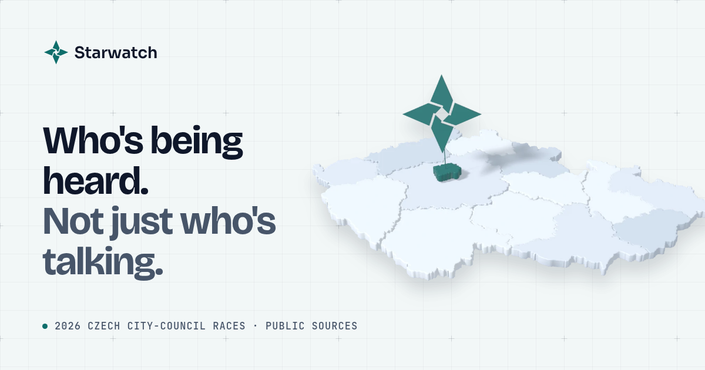
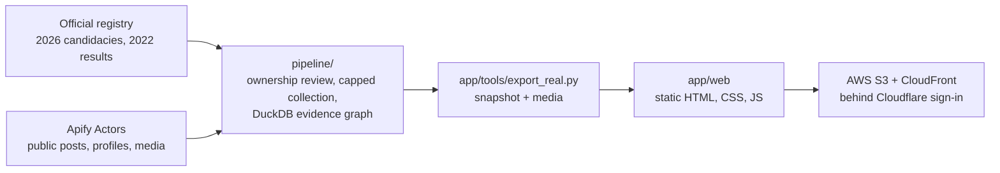

<p align="center">
  <a href="https://starwatch.agenticanalytics.cz"></a>
</p>

<h1 align="center">Starwatch</h1>

<p align="center"><strong>Who's being heard. Not just who's talking.</strong></p>

<p align="center">
  <a href="https://starwatch.agenticanalytics.cz"></a>
  <a href="https://www.linkedin.com/in/1vecera/"></a>
  <a href="https://x.com/1vecera"></a>
  <a href="LICENSE"></a>
</p>

Starwatch maps what candidates in the 2026 Czech municipal elections publish on social media and how much attention it gets. It covers the city-council races in the ten largest Czech cities: Praha, Brno, Ostrava, Plzeň, Liberec, Olomouc, České Budějovice, Hradec Králové, Pardubice and Ústí nad Labem, with 5,405 registered candidacies on 127 lists. Every post is attributed only after the account's owner was checked independently, and every post links back to the original.

**Live: [starwatch.agenticanalytics.cz](https://starwatch.agenticanalytics.cz).** The welcome page is public; sign in with any GitHub, Google or Facebook account to open the app.

> **A snapshot, not live monitoring.** The app shows public posts collected on 8–9 October 2026, just before the vote: over 12,000 posts from more than 100 verified candidate and party accounts on Instagram, Facebook, TikTok and X. Engagement is a dated observation of attention, not a measure of support. Following the Czech pre-election ban on publishing polls, Starwatch shows no polls, forecasts or betting odds.

Built by [Daniel Večeřa](#author) in one night at [Agents 0.0.7](https://agents007.ai) in Prague (8–9 October 2026) as team DANDAPANDA in the Social Media Deep Research track, then cleaned up for public release. The tag [`hackathon-freeze`](https://github.com/1vecera/starwatch/tree/hackathon-freeze) marks the state that was judged.

## Screens

| Screen | What it shows |
| --- | --- |
| **Star Atlas** | A map of Czechia. Pick a city and fly into its streets; each list becomes an island of its posts, sized by reach. Rank by reach, views, likes and comments, or number of posts. |
| **Spotlight** | One candidate or list: portrait or logo, 2022 results where they match, best posts with video playback, quoted statements, topics and links to the sources. |
| **Pulse** | People or lists side by side. 2022 ballots and observed attention stay separate measures, each with its observation window, never merged into one score. |
| **Radar** | A watchlist over the city map: who posted what and how it landed in the snapshot window. |
| **By the numbers** | What the snapshot contains by platform, city and list, and what was not collected. |
| **About** | Method, sources, limitations and who built it. |

## How it works



1. **Universe.** The official registry of 2026 candidacies and the 2022 results for the ten cities come from Czech Statistical Office open data.
2. **Collection.** [Apify](https://apify.com) Actors find candidate and list accounts and collect their public posts, profile details and media. Every run has a hard cost cap and is recorded in a ledger. The lists' published programs and press mentions are gathered separately.
3. **Evidence graph.** [`pipeline/`](pipeline/) attributes a post only when the account owner was confirmed by an independent public anchor, keeps uncertain matches as unknown, and writes immutable DuckDB checkpoints with dated metrics, reviewed topic labels and quoted statements.
4. **Export.** [`app/tools/export_real.py`](app/tools/export_real.py) turns one checkpoint into the snapshot file and retained media that the screens load.
5. **Static app.** [`app/web`](app/web/) is plain HTML, CSS and JavaScript with MapLibre and ECharts. There is no build step.
6. **Hosting.** The site is a private S3 bucket behind CloudFront, fronted by Cloudflare. A Cloudflare Worker handles GitHub, Google and Facebook sign-in, and a CloudFront Function lets visitors without a session reach only the public welcome pages. The collected snapshot never enters Git.

The full write-up is in [docs/architecture.md](docs/architecture.md) and [docs/methodology.md](docs/methodology.md).

## Quick start

You need Python 3.12 or newer and [uv](https://docs.astral.sh/uv/).

```sh
git clone https://github.com/1vecera/starwatch.git
cd starwatch
./run.sh
```

Open <http://127.0.0.1:5173/>. A fresh checkout runs the **simulated universe**: generated candidates, lists, posts and metrics at the real per-city scale, labelled "Simulated" on every screen. It needs no credentials and starts no paid collection. The base map loads from OpenFreeMap when online; a bundled outline of Czechia is the offline fallback.

To collect your own data, set `APIFY_TOKEN` in your environment and follow [the Apify recipes](docs/apify-recipes.md) and the [pipeline guide](pipeline/README.md). The exporter's input format is described in [app/tools/RAW_FORMAT.md](app/tools/RAW_FORMAT.md).

### Tests

```sh
(cd pipeline && uv sync && uv run --with pytest pytest)
(cd app && uv run --with pytest pytest tools/test_serve.py)
```

Both suites use local fixtures only. The archived components keep their own tests; see [archive/README.md](archive/README.md).

## Repository map

| Path | Contents |
| --- | --- |
| [`app/`](app/) | The static app, the snapshot exporter and a small local server with HTTP range support for video. |
| [`pipeline/`](pipeline/) | The evidence pipeline (`czlake`): official data, account discovery and ownership review, capped Apify collection, media retention, topic labels, DuckDB checkpoints and a read-only local API. |
| [`deploy/`](deploy/) | The Cloudflare sign-in Worker and the CloudFront gate. |
| [`docs/`](docs/) | The story, method, architecture, Apify recipes, learnings and the privacy and ethics notes. |
| [`recipes/`](recipes/) | Reusable Apify Actor inputs described in the recipes guide. |
| [`archive/`](archive/) | Earlier hackathon code: the first research engine, prototypes and the project control room. Not needed to run Starwatch. |

## Documentation

- [docs/README.md](docs/README.md): index of the documentation
- [docs/story.md](docs/story.md): how Starwatch was built in one night, and what changed for the public release
- [docs/apify-recipes.md](docs/apify-recipes.md): the Apify Actors, inputs, caps and costs used for collection
- [docs/learnings.md](docs/learnings.md): what worked, what did not, and what to do differently
- [docs/methodology.md](docs/methodology.md): universe, attribution rules, metrics and their limits
- [docs/architecture.md](docs/architecture.md): pipeline, export, static app and hosting
- [docs/privacy-and-ethics.md](docs/privacy-and-ethics.md): what is collected, what is not, and why
- [docs/collection/programs-and-articles.md](docs/collection/programs-and-articles.md): how list programs and press mentions were found

## Principles

Starwatch covers public politicians and public sources only. It does not collect comments, commenters or follower lists, does not profile voters, does not infer sensitive traits, and does not score anyone's character or trustworthiness. Account ownership, authorship, mentions and quoted speakers are kept as separate questions, and unknowns stay unknown. Candidate vote totals from 2022 include whole-list allocation and are not preference-only votes. The app links to original posts; the collected snapshot is served only behind sign-in and is not part of this repository.

Corrections and removal requests are welcome: see [CONTRIBUTING.md](CONTRIBUTING.md). Security issues: see [SECURITY.md](SECURITY.md).

## Author

**Daniel Večeřa**, Prague.

- LinkedIn: [linkedin.com/in/1vecera](https://www.linkedin.com/in/1vecera/)
- X: [@1vecera](https://x.com/1vecera)

If Starwatch is useful to you, or you want something like it for another election, country or question, get in touch on LinkedIn or X.

## License

The code and documentation are released under the [MIT License](LICENSE). Third-party components keep their own licenses: MapLibre GL JS (BSD-3-Clause) and Apache ECharts (Apache-2.0) in [`app/web/vendor`](app/web/vendor/), the Czech boundaries from [siwekm/czech-geojson](https://github.com/siwekm/czech-geojson) (CC BY 4.0, derived from ČÚZK open data), and the self-hosted fonts in the archived prototypes (SIL Open Font License 1.1, notices beside the files). Posts, images and videos shown in the app belong to their authors and are not covered by this license.
