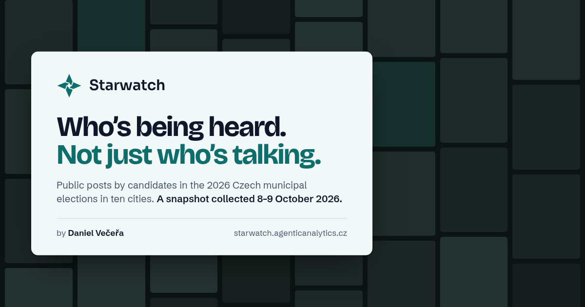

# Starwatch app

**Who's being heard. Not just who's talking.**



Starwatch maps the public posts of candidates and party lists in the 2026 Czech municipal elections in ten cities, linked to the people and lists behind them. It is live at [starwatch.agenticanalytics.cz](https://starwatch.agenticanalytics.cz): the welcome page and About are public, and any GitHub, Google or Facebook account can sign in to the rest.

It shows a **snapshot**, not live monitoring: public posts collected on 8–9 October 2026 (checkpoint `production-native-009`, exported 9 October 2026 at 06:39 Prague time). Every screen says so in the top bar, and every post opens the public source it was observed on.

Made by [Daniel Večeřa](https://www.linkedin.com/in/1vecera/) ([X](https://x.com/1vecera)), Prague. It started at the Agents 0.0.7 hackathon in Prague. The code is MIT-licensed; the collected snapshot is not in this repository.

## Screens

| Screen | File | What it does |
| --- | --- | --- |
| **Welcome** | `index.html` (alias `welcome.html`) | Public front page: a wall of the most-viewed collected posts behind one card, with the snapshot line, "Open Star Atlas" and follow links. It works on phones in portrait as well as on a 1920×1080 stage. |
| **Star Atlas** | `atlas.html` | A map of Czechia with ten city markers sized by the chosen metric. A city opens its street map, with party islands of real posts sized by reach. Rank by reach, views, likes and comments, or posts. The side panel has a party or list finder, a party lens, topic chips with counts, platforms and time windows. The inspector shows posts with playback, 2022 results, the topic mix, and the program and news when present. |
| **Spotlight** | `spotlight.html` | One person or list: best posts, 2022 result, a topic mix that filters the posts, program and promises, and news mentions. |
| **Pulse** | `pulse.html` | Two to four people or lists side by side, in one city or across cities: cumulative attention, best posts, cadence, format mix, topic mix, and the 2022 result next to attention at collection. The two are never combined. |
| **Radar** | `radar.html` | A watchlist for one city, replayed over the snapshot: what the watched people and lists published in the 48 hours before collection, how each post landed (reach, likes and comments, outliers against the account's own posts), and a link to every source. It has a city switch and the party finder. It is purely observational: it drafts nothing and suggests no replies. |
| **By the numbers** | `data.html` | Posts available, playable videos, observed views, likes and comments, by platform, city and party. |
| **About** | `about.html` | Public documentation: how to read each screen, data sources, snapshot coverage by platform and city, limitations, privacy, source code and the author. |

The chrome on every screen (`brand/chrome.js`, `brand/chrome.css`) carries the screen dock, search (⌘K or Ctrl+K), the snapshot chip linking to About, the author pill with LinkedIn and X follow links, and an account menu with About, privacy, the source code and **Sign out** (`/auth/logout`).

### Deep links

- **Star Atlas:** `?city=`, `?list=`, `?cand=`, `?asset=`, `?party=<key>` (for example `ods`, `stan`, `pirati`), `?topic=`, `?rank=`
- **Spotlight:** `?cand=`, `?list=`, `?asset=`, `?topic=`
- **Pulse:** `?mode=person|party`, `?cands=`, `?lists=`, `?party=`
- **Radar:** `?city=`, `?list=`, `?cand=`, `?party=`

City, list, candidate and post parameters are indexes into the exported snapshot. Party keys are stable names.

## Shared modules

- `sw-real.js`: turns the exported snapshot (`window.SW_RAW`) into the `SW` model every screen reads. It merges reviewed local issues and machine topic labels, and defines `SW.snapshot`, `SW.topicMeta()` and `SW.TOPIC_NOTE`.
- `sw-picker.js`: the searchable party and list picker used by Atlas, Pulse and Radar. It covers all 127 lists with logos, short names and cities. It also groups lists of the same national party across cities; a coalition counts under each member party, using the export's party logos and the registry short names.
- `sw-panels.js`: the topic mix, "Program and promises" and "In the news" panels used by Spotlight and the Atlas inspector.
- `mock.js`: the simulated universe (`?data=sim`), with generated names and posts at the real per-city scale. It is labelled on every screen and never mixed with real people.

## Data files

Everything under `web/data/`, `web/media/` and `web/welcome/` stays out of Git.

| File | Contents | On the edge |
| --- | --- | --- |
| `data/real.js` | The exported snapshot (`tools/export_real.py`) | Behind sign-in |
| `data/stats.js` | Public aggregate counts for About (`tools/export_stats.py`): coverage by platform, city and topic, plus logo credits. It holds no names, post text or media. | Public |
| `data/issue-topics.js` | Named local issues, reviewed from captions | Behind sign-in |
| `data/topic-labels.js` | Optional machine topic labels (`window.SW_TOPIC_LABELS`). They never override a reviewed label, and each carries the phrase it rests on. | Behind sign-in |
| `data/programs.js`, `data/articles.js` | Optional party programs and news mentions (`window.SW_PROGRAMS`, `window.SW_ARTICLES`) | Behind sign-in |
| `media/` | Retained post images, videos, portraits and logos | Behind sign-in |
| `welcome/` | Copies of the 53 files on the welcome wall (`tools/copy_welcome_media.py`) | Public |

The public pages load only `/`, `/index.html`, `/welcome.html`, `/about.html`, `/og.png`, `/manifest.webmanifest`, `/ds.css`, `/nav.js`, `/data/stats.js` and the folders `/welcome/`, `/brand/`, `/fx/` and `/img/`, plus Google Fonts. `tools/check-launch.mjs` asserts this.

## Run it

```sh
./run.sh                  # export the snapshot if the checkpoint is on this machine, build stats, serve http://127.0.0.1:5173/
SKIP_EXPORT=1 ./run.sh    # serve what is already exported
```

`run.sh` needs [uv](https://docs.astral.sh/uv/). It creates null stubs for the optional data files, so a checkout without them has no 404s. The server (`tools/serve.py`) handles HTTP byte ranges, so videos stream and seek. The app itself is dependency-free static HTML, CSS and JavaScript. MapLibre and ECharts are vendored.

Checks run against a running server and use a headless Chromium (`CHROME=...` overrides the binary):

```sh
node tools/check-launch.mjs http://127.0.0.1:5173   # every screen at 1440x900 and 390x844, deep links, public-page requests, wording
node tools/check-atlas-c.mjs http://127.0.0.1:5173  # Star Atlas behaviour: city fly-in, islands, rank by, topic lens, playback
node tools/walkthrough.mjs http://127.0.0.1:5173    # screenshots of the main path at desktop and phone size
```

## What the snapshot covers

- **Posts:** 12,595 public posts from 110 independently verified accounts: 9,157 Instagram, 2,567 Facebook, 598 TikTok and 273 X. One YouTube account was verified but none of its posts were retained. News sites and the web were not collected as posts.
- **Media:** 11,558 posts keep their image and 2,178 videos play in the app.
- **Registry:** 5,405 registered candidacies on 127 lists in Praha, Brno, Ostrava, Plzeň, Olomouc, České Budějovice, Hradec Králové, Liberec, Pardubice and Ústí nad Labem. The lists come from the volby.gov.cz KV2026 registry.
- **2022 results:** ČSÚ open data, matched to 2026 lists and candidates only where the match is unambiguous. Candidate totals include list-vote allocation.
- **Topics:** 768 posts carry reviewed topic labels from a checked sample. Machine labels, when that file is present, cover the rest. Each machine label is backed by a quoted phrase, can be wrong, and is marked "machine" wherever it is shown.
- **Collection:** public profiles were collected with Apify Actors, and account ownership was checked independently. Party logos come from Wikimedia Commons with their licences.

## Limitations

- These are dated observations of attention, not support, votes or polls. A view is not a unique person.
- Profile samples are recent and incomplete; follower counts are single snapshots, so no growth is claimed.
- Ownership checks can miss or mis-assign accounts. "Not observed" is not the same as zero.
- No polls, forecasts or betting odds are shown. Czech election law (§ 30(2) of Act 491/2001 Sb.) bans publishing poll results from 7 October until voting ends on 10 October 2026 at 14:00, and the exporter no longer carries forecast data.
- Starwatch does not profile voters or commenters, stores no commenter records, and writes no replies or messaging: every screen only shows what was published and how it landed.
