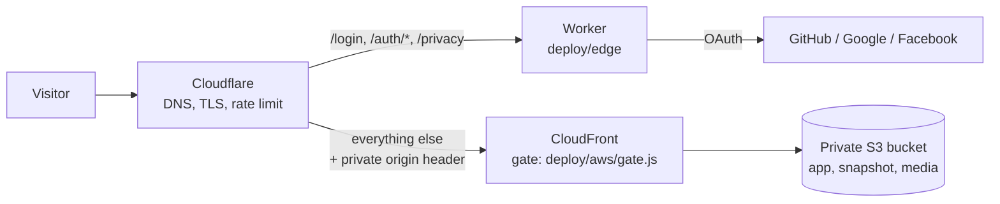

# Deploying Starwatch

The public app runs at [starwatch.agenticanalytics.cz](https://starwatch.agenticanalytics.cz). The welcome page, privacy notice and sign-in page are public; the app, its snapshot and media need a sign-in with GitHub, Google or Facebook.



- **Worker (`deploy/edge`)** runs the OAuth round trip with minimal scopes (GitHub: none, Google: `openid`, Facebook: `public_profile`), confirms the account with one identity call and sets `__Host-sw-session`, a seven-day cookie with a random identifier and an HMAC signature. No user data is stored anywhere. PKCE protects the GitHub and Google flows; a signed, ten-minute state cookie protects all three.
- **CloudFront Function (`deploy/aws/gate.js`)** accepts only requests that carry the private origin header Cloudflare adds, serves the welcome page and its assets publicly, and checks the session signature for everything else. Signed-out page requests go to `/login?return=…`; other files get 401. Media byte ranges pass through untouched, so video seeks work.
- **Cloudflare rules**: a Transform Rule sets the origin header, a Cache Rule keeps signed-in content out of Cloudflare's cache, a Configuration Rule enforces strict TLS to CloudFront, and a rate limit slows floods on `/auth/`. Static traffic never invokes the Worker, so the free Workers quota is not a limit.

## Run it

Copy `config.example.json` outside the repository, fill in your own account handles, and provide credentials as environment variables: AWS (standard boto3 variables), Cloudflare (`CLOUDFLARE_API_TOKEN`, or a global key with `CLOUDFLARE_GLOBAL_API_KEY` and `CLOUDFLARE_EMAIL`) and the OAuth clients (`STARWATCH_GITHUB_ID`, `STARWATCH_GITHUB_SECRET`, `STARWATCH_GOOGLE_ID`, `STARWATCH_GOOGLE_SECRET`, `STARWATCH_FACEBOOK_ID`, `STARWATCH_FACEBOOK_SECRET`). Missing providers are simply not offered on the sign-in page.

```sh
cd deploy/edge && npm ci && npm test && cd ../..
uv run --with boto3 python deploy/launch.py --config ../starwatch-deploy.json keys cert cloudfront cloudflare worker site verify
```

Each step is idempotent. `keys` creates the session and origin keys in AWS Secrets Manager once; `cert` requests and DNS-validates the CloudFront certificate; `cloudfront` publishes the gate and adds the hostname; `cloudflare` sets DNS and the zone rules; `worker` deploys the Worker, its secrets and routes; `site` uploads changed files (SHA-256 in object metadata) and invalidates them; `verify` checks anonymous denial, signed access, forged-cookie rejection, direct-origin refusal and video ranges.

OAuth callback URLs are `https://<host>/auth/callback/github`, `/google` and `/facebook`. The privacy policy and data-deletion instructions the providers ask for are served at `/privacy` and `/data-deletion`.
