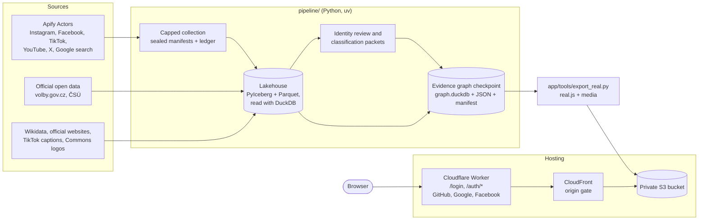

# Architecture

Starwatch is a batch system with a static front end. Python collects public evidence under a spending ledger, organises it into a versioned evidence graph in DuckDB, and exports one immutable snapshot. A static web app reads that snapshot. In production the app and its media sit in a private AWS bucket behind CloudFront, and a Cloudflare Worker handles sign-in at the edge.

## Collection

All paid collection goes through Apify Actors; [Apify recipes](apify-recipes.md) documents each one. Production collection is driven by sealed manifests ([production_collect.py](../pipeline/src/czlake/production_collect.py)): each pins the Actor, the exact input and its hash, item cap, timeout, memory, provider spending cap and a price snapshot. A single coordinator owns the ledger ([production_budget.py](../pipeline/src/czlake/production_budget.py)), which commits money and its audit journal in one atomic write. A run is reserved at its full cap before the request, its start boundary is recorded, and it is never retried blindly. Dataset items pass through a per-Actor allowlist before they are written, so comments, commenter identities, mentions and unknown fields never reach disk.

Free sources are fetched directly: the official election and population open data ([build/fetch_volby.py](../pipeline/src/czlake/build/fetch_volby.py), [build/universe.py](../pipeline/src/czlake/build/universe.py)), Wikidata ([build/wikidata.py](../pipeline/src/czlake/build/wikidata.py)), TikTok's caption tracks right after each TikTok run ([build/tiktok_subs.py](../pipeline/src/czlake/build/tiktok_subs.py)), and a bounded number of public pages on official websites ([production_identity.py](../pipeline/src/czlake/production_identity.py), [production_web.py](../pipeline/src/czlake/production_web.py)). Media files are downloaded from the platforms' CDNs at collection time, because the links expire; [production_media.py](../pipeline/src/czlake/production_media.py) checks the source binding, size, MIME type and hash of each file.

## Lakehouse

The exploration layer is an Apache Iceberg lakehouse in a local PyIceberg SQLite catalog with a Parquet warehouse, queried through DuckDB ([lakehouse.py](../pipeline/src/czlake/lakehouse.py)). It has four namespaces: `raw_idx` indexes every raw landing with its source URL, fetch time and run ID; `staging` holds parsed source tables; `core` holds candidacies, persons, parties, accounts and results across 14 elections; `marts` holds the city profiles and research rankings. Every row keeps its source URL and fetch time.

## Evidence graph checkpoints

[production_graph.py](../pipeline/src/czlake/production_graph.py) builds an immutable checkpoint from the lake, the reviewed identity files, the frozen classification bundles and the media, photo, logo, web and election supplements. A checkpoint is a directory with `graph.duckdb`, compact JSON files (areas, entities, accounts, assets, claims, topics, coverage, quality) and a manifest with the hash of every input and output. The exporter runs SQL integrity gates (39 for the launch checkpoint) and only then atomically replaces the `current.json` pointer. A failed build leaves the previous pointer in place; this happened on the last attempted checkpoint of the night, which a label-source gate refused.

The main DuckDB tables are `area`, `entity`, `account`, `account_observation`, `account_relation`, `asset`, `asset_observation`, `asset_relation`, `metric`, `claim`, `topic`, `claim_topic`, `source` and `quarantine`, plus media, photo, logo, web and election tables. [Methodology](methodology.md) explains what they mean.

A local read API ([production_api.py](../pipeline/src/czlake/production_api.py)) serves a checkpoint over HTTP on loopback with read-only DuckDB, bounded pagination, checkpoint pinning (a changed pointer returns 409) and strict Host/Origin checks. The pipeline [README](../pipeline/README.md) lists its routes.

## Export

[app/tools/export_real.py](../app/tools/export_real.py) reads `current.json` once, verifies the manifest hash, opens the database read-only and writes `app/web/data/real.js`, a single script that sets `window.SW_RAW`. It copies only admitted preview images, videos, photos and logos into `app/web/media/`. Optional files sit beside it: `stats.js` with collection totals, and `programs.js` and `articles.js` with party programmes and news articles. The app must work when any optional file is absent. The format is documented in [app/tools/RAW_FORMAT.md](../app/tools/RAW_FORMAT.md). The snapshot and media are not committed to Git.

## The app

The app is static HTML, CSS and JavaScript in [app/web/](../app/web/), with vendored MapLibre GL and Apache ECharts and an OpenFreeMap base map with an offline fallback. [sw-real.js](../app/web/sw-real.js) turns `window.SW_RAW` into one shared model that every screen reads. Without a snapshot the app runs on a clearly labelled simulated universe, so a fresh checkout works with no data and no credentials.

| Screen | File | Purpose |
| --- | --- | --- |
| Welcome | `welcome.html` | Public landing page: what Starwatch is, the snapshot date, sign-in |
| Star Atlas | `atlas.html` | Map of Czechia → city → party lists → people → posts and videos |
| Spotlight | `spotlight.html` | One person or list: accounts, posts, statements, topics, dated metrics, 2022 results |
| Pulse | `pulse.html` | Comparison of observed activity with stated windows and coverage |
| Radar | `radar.html` | Activity inside the snapshot by town |
| By the numbers | `data.html` | Coverage by platform, city and list |

Locally, [tools/serve.py](../app/tools/serve.py) serves the app with correct MIME types and single HTTP byte ranges, so videos can seek.

## Hosting and sign-in

The public site is [starwatch.agenticanalytics.cz](https://starwatch.agenticanalytics.cz).

- **Storage.** The exported app, snapshot and media (about 20 GB) are in a private, encrypted S3 bucket in Frankfurt. The bucket accepts reads only from its CloudFront distribution.
- **Edge sign-in.** A Cloudflare Worker serves `/login` and `/auth/*` and implements OAuth sign-in with GitHub, Google and Facebook. There are no passwords and no email codes. `/auth/logout` ends the session.
- **Origin gate.** CloudFront serves the public welcome page to anyone. Every other page, the snapshot and all media require a request that came through the Worker for a signed-in visitor; anything else is redirected to sign-in or refused.
- **Responses.** Pages and media are sent with `private, no-store`, `noindex` and `no-referrer`. Video byte ranges are passed through so seeking works.
- **Secrets.** OAuth client secrets and the origin key live in Cloudflare and AWS secret stores, never in the repository.

The jury copy on the morning of 9 October went through two earlier versions of this: Amazon Cognito email codes, which ran into Cognito's built-in limit of 50 emails per day per AWS account, and then Cloudflare Access with GitHub only. [The story](story.md) has the details.

## Other components in the repository

| Directory | What it is |
| --- | --- |
| [collector/](../collector/) | The first-plan research engine: FastAPI, SQLite, server-sent events, live identity resolution from an anchor website, six Apify lanes, Scribe transcription and extractive briefs with quote and timecode verification. Not part of the public site. |
| [workspace/](../workspace/) | The local control room used to run the night: Kanban from `TODO.md`, decisions, evidence, architecture diagram and an agent CLI. |
| [archive/](../archive/) | Earlier prototypes, kept for completeness. |

## Running it yourself

`./run.sh` starts the app on the labelled simulated data with no credentials. To build real data you need an Apify token in `APIFY_TOKEN` and your own authorisation for a bounded batch; the pipeline [README](../pipeline/README.md) shows how to initialise the ledger, run a manifest, build a checkpoint and serve it, and `app/tools/export_real.py --project /path/to/project` exports it into the app.
